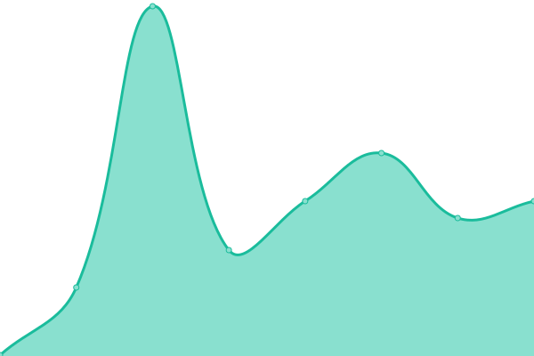
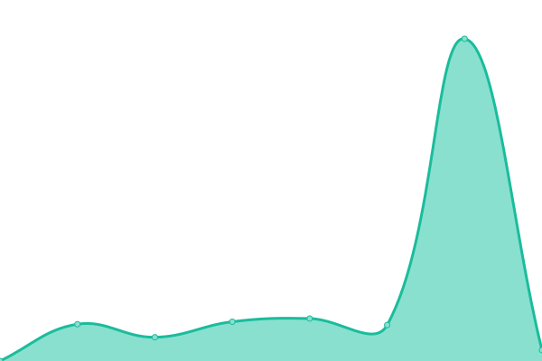

# [📈 Live Status](https://status.gw2auth.com): <!--live status--> **🟩 All systems operational**

This repository contains the open-source uptime monitor and status page for [gw2auth](https://gw2auth.com), powered by [Upptime](https://github.com/upptime/upptime).

With [Upptime](https://upptime.js.org), you can get your own unlimited and free uptime monitor and status page, powered entirely by a GitHub repository. We use [Issues](https://github.com/gw2auth/uptime/issues) as incident reports, [Actions](https://github.com/gw2auth/uptime/actions) as uptime monitors, and [Pages](https://status.gw2auth.com) for the status page.

<!--start: status pages-->
<!-- This summary is generated by Upptime (https://github.com/upptime/upptime) -->
<!-- Do not edit this manually, your changes will be overwritten -->
<!-- prettier-ignore -->
| URL | Status | History | Response Time | Uptime |
| --- | ------ | ------- | ------------- | ------ |
|  [GW2Auth](https://gw2auth.com) | 🟩 Up | [gw-2-auth.yml](https://github.com/gw2auth/uptime/commits/HEAD/history/gw-2-auth.yml) | 

 146ms
     
 | 

<a href="https://status.gw2auth.com/history/gw-2-auth">100.00%</a>
    

|  [Discovery Endpoint](https://gw2auth.com/.well-known/oauth-authorization-server) | 🟩 Up | [discovery-endpoint.yml](https://github.com/gw2auth/uptime/commits/HEAD/history/discovery-endpoint.yml) | 

 134ms
     
 | 

<a href="https://status.gw2auth.com/history/discovery-endpoint">100.00%</a>
    

|  Token Refresh | 🟩 Up | [token-refresh.yml](https://github.com/gw2auth/uptime/commits/HEAD/history/token-refresh.yml) | 

 1675ms
     
 | 

<a href="https://status.gw2auth.com/history/token-refresh">100.00%</a>
    

<!--end: status pages-->

[**Visit our status website →**](https://status.gw2auth.com)

## 📄 License

- Powered by: [Upptime](https://github.com/upptime/upptime)
- Code: [MIT](./LICENSE) © [Anand Chowdhary](https://anandchowdhary.com), supported by [Pabio](https://pabio.com)
- Data in the `./history` directory: [Open Database License](https://opendatacommons.org/licenses/odbl/1-0/)
